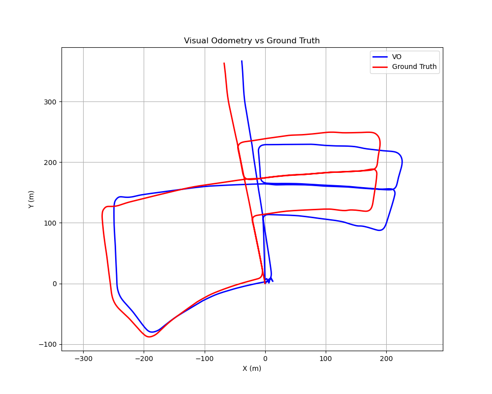

# Stereo Visual Odometry with SuperPoint + LightGlue

A stereo visual odometry pipeline using learned feature matching
and PnP RANSAC, evaluated on the KITTI odometry benchmark.

---

##  Demo

---

##  Problem & approach

Classical ORB-based odometry degrades in low-texture and low-light scenes.
This pipeline replaces handcrafted descriptors with SuperPoint keypoints
and LightGlue for robust cross-frame matching, feeding matched 3D–2D
correspondences into PnP RANSAC for pose estimation.

**Pipeline stages:**
1. SuperPoint keypoint detection — up to 2,048 keypoints per frame
2. LightGlue feature matching across temporal and stereo pairs
3. Stereo triangulation for 3D point reconstruction (disparity range: 0.5–120 px)
4. PnP RANSAC pose estimation (reprojection threshold: 2.0 px, confidence: 0.99)
5. Local bundle adjustment every 10 frames via Levenberg-Marquardt optimisation

---

##  Results — KITTI Sequence 00

Evaluated on sequence 00 (2011_09_30_drive_0018):
4,541 stereo pairs covering ~3.7 km of urban driving.

| Metric                    | Value     |
|---------------------------|-----------|
| Mean ATE                  | 27.68 m   |
| Median ATE                | 26.67 m   |
| Max ATE                   | 51.65 m   |
| RMSE                      | 21.26 m   |
| Relative trajectory error | **0.75%** |

> Max ATE of 51.65 m ≈ 1.4% of total trajectory length.  
> RTE of 0.75% is within the 1–2% range of competitive stereo VO systems on KITTI.

### Parameter sensitivity

| Configuration                      | Mean ATE (m) | Max ATE (m) | RMSE (m) | Δ Mean ATE |
|------------------------------------|--------------|-------------|----------|------------|
| Baseline (2048 kpts, 30px, BA=10)  | 27.68        | 51.65       | 21.26    | —          |
| Keypoints = 512                    | 26.32        | 49.08       | 20.15    | −4.9%      |
| Keypoints = 1024                   | 27.91        | 206.93      | 21.45    | +0.8%      |
| Matching threshold = 10px          | 26.38        | 48.54       | 20.29    | −4.7%      |
| Matching threshold = 50px          | 26.56        | 51.06       | 20.62    | −4.0%      |
| Bundle adjustment = 5 frames       | 27.70        | 51.65       | 21.27    | +0.1%      |
| Bundle adjustment = 20 frames      | 27.65        | 51.65       | 21.26    | −0.1%      |

##  References

- SuperPoint: DeTone et al., CVPRW 2018 — [doi:10.1109/CVPRW.2018.00060](https://doi.org/10.1109/CVPRW.2018.00060)
- LightGlue: Lindenberger et al., ICCV 2023 — [doi:10.1109/ICCV51070.2023.01616](https://doi.org/10.1109/ICCV51070.2023.01616)
- KITTI dataset: Geiger et al., IJRR 2013
- PnP RANSAC: Fischler & Bolles, CACM 1981
